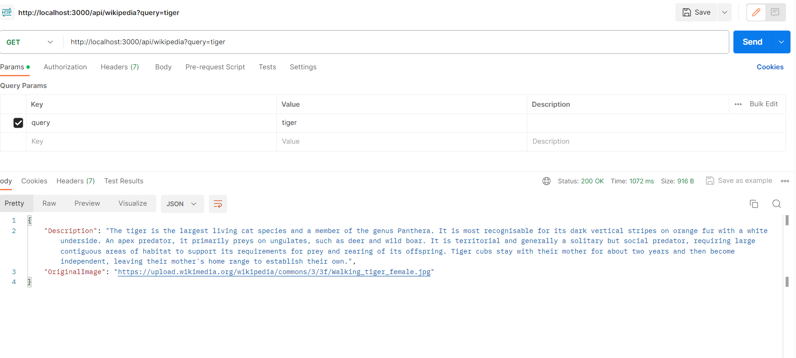
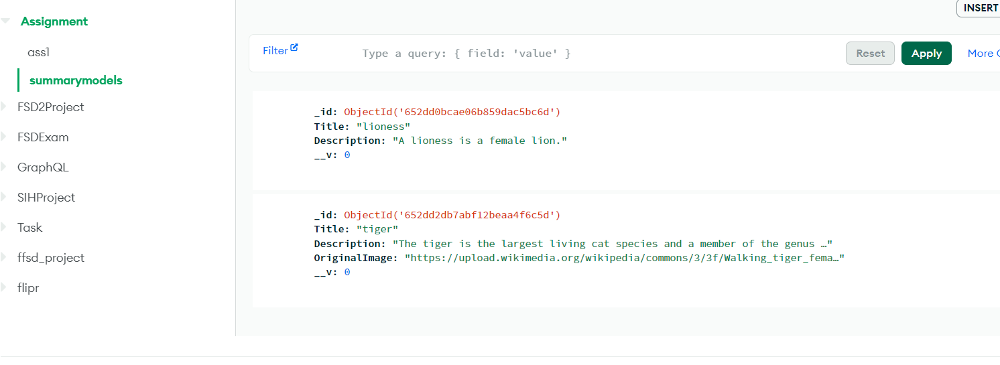

## Setup the project

 - Download this template from github and open it in your favourite text editor.
 - Go inside the root directory and execute the following command.
        npm i
        npm run build
        node dist/index.js
    
 - In the root directory create a `.env` file and add the follwing env variables
        USERR = <database user name>
        PASSWORD = <database user password>
        DATABASE= <database name>

- Add the necessary env variables in the `.env` file

## API

### Search 
Go to Postman and make a get request to `http://localhost:3000/api/wikipedia?query=motivate` , you can use any query to test..
http

    GET /wikipedia/?query=title
    Checks the database if a document of this title exists, if not it searches through the wikipedia api and saves 
    the resulting document in the collection with the title, summary and the original image.

## Results

